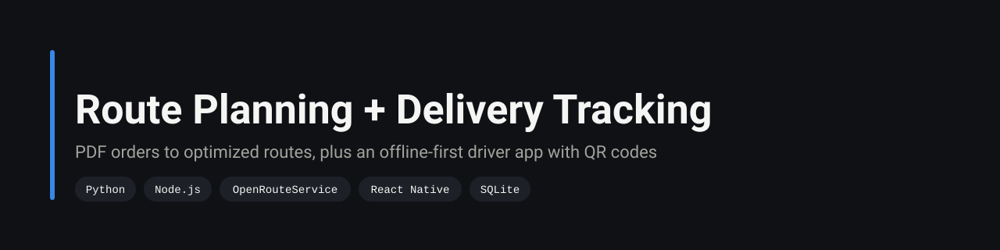
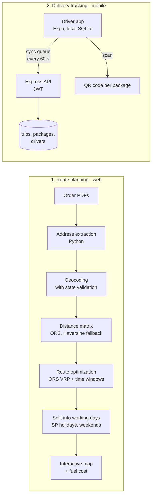

<p align="center">
  
</p>

<p align="center">
  
  
  
  
  
  
</p>

> Planning a day of deliveries used to mean reading order PDFs, looking up each address and ordering the stops by hand, which took about 3 hours. With this system it takes about 2 minutes, and drivers confirm every package from their phone even without signal.

<sub>The 3 h to 2 min comparison is the author's measurement in daily operation. Addresses and identifiers in this repository are fictitious.</sub>

## Two independent modules



## What is inside

| Part | Details |
|---|---|
| PDF extraction | `services/pdf_extractor.py` reads order PDFs in batch and pulls out the delivery addresses |
| Geocoding | `services/geocoder.py` geocodes and separates valid from invalid results, so a bad address is reported instead of silently misplaced |
| Optimization | `services/route_optimizer.py` and `api/optimize.js` call the OpenRouteService optimization API (vehicle routing with time windows, up to 100 stops per request); if it is unavailable, a Haversine matrix and nearest-neighbor ordering take over |
| Calendar | Routes are split across days, skipping weekends and São Paulo state holidays (`holidays` library) |
| Cost | `api/fuel-price.js` scrapes the local fuel price with a fixed fallback; route cost = km / 10 × price |
| Tracking API | Express with JWT auth: trips, packages, QR codes and a sync endpoint (`monitoramento-entrega/server`) |
| Driver app | Expo / React Native, writes everything to local SQLite first and flushes a sync queue every 60 s, built for areas with poor coverage |

About 2,300 lines across Python, Node.js and SQL, plus the TypeScript app.

## Run it

Route planning (web):

```bash
npm install
export OPENROUTESERVICE_API_KEY=...   # free key at openrouteservice.org
node server.js                        # http://localhost:3000
# POST /api/process   orders in, geocoded stops out (see exemplo_entrada.json)
# POST /api/optimize  stops in, optimized route + distance + fuel cost out
```

Delivery tracking:

```bash
cd monitoramento-entrega/server && npm install && npm start
cd ../app && npm install && npx expo start
```

## Engineering decisions

| Decision | Why |
|---|---|
| OpenRouteService optimization API, with a local fallback | Real road distances and time windows without running a routing engine. When the API key is missing or the quota runs out, Haversine plus nearest neighbor still produces a usable route. |
| Validate geocoding against the expected state | Geocoders happily return a street with the same name in another state. Rejecting those avoids routes that jump hundreds of kilometers. |
| Offline-first app with a sync queue | Drivers lose signal on the road. Writing locally first means no scan is ever lost, and the server catches up when the phone reconnects. |
| QR code per package | One scan identifies the package and updates its status, with no typing on a phone while standing at a door. |

## Limitations

- No automated tests.
- The fuel price is scraped from a public page for one city; if the page layout changes, the fallback price is used.
- Nearest neighbor is a heuristic. It is only the fallback, but routes from it can be noticeably longer than the optimized ones.

## Author

**Silvano Moraes de Souza**, Software Engineer · Python, APIs, automation and data in production
[LinkedIn](https://www.linkedin.com/in/silvano-moraes-de-souza) · [Portfolio](https://silvanomsouza.vercel.app/) · [GitHub](https://github.com/silvano-moraes-de-souza)
